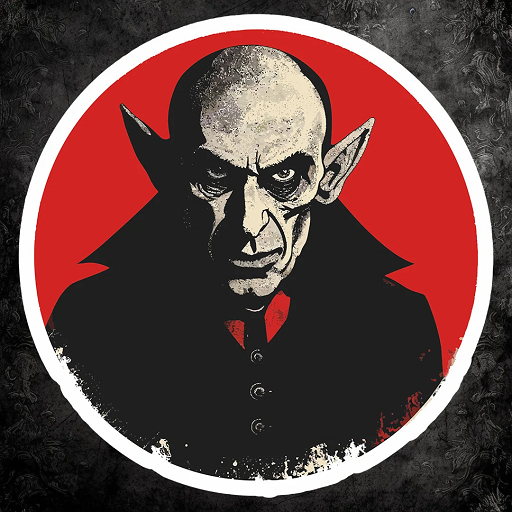
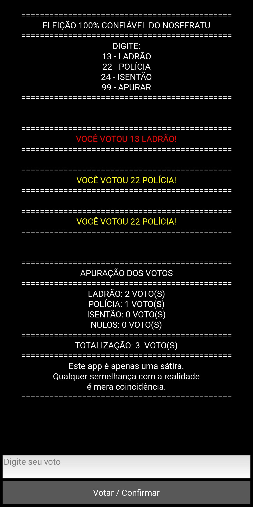

Nosferatu é um app de zoeira, pra simular fraude eleitoral. Qualquer semelhança com a realidade, é mera coincidência, ok?

Neste script, a cada 2 votos na POLÍCIA, apesar da mensagem em tela confirmar a escolha, 1 voto é contabilizado para o LADRÃO.

Os demais votos são computados e apurados normalmente na totalização de votos do script.

